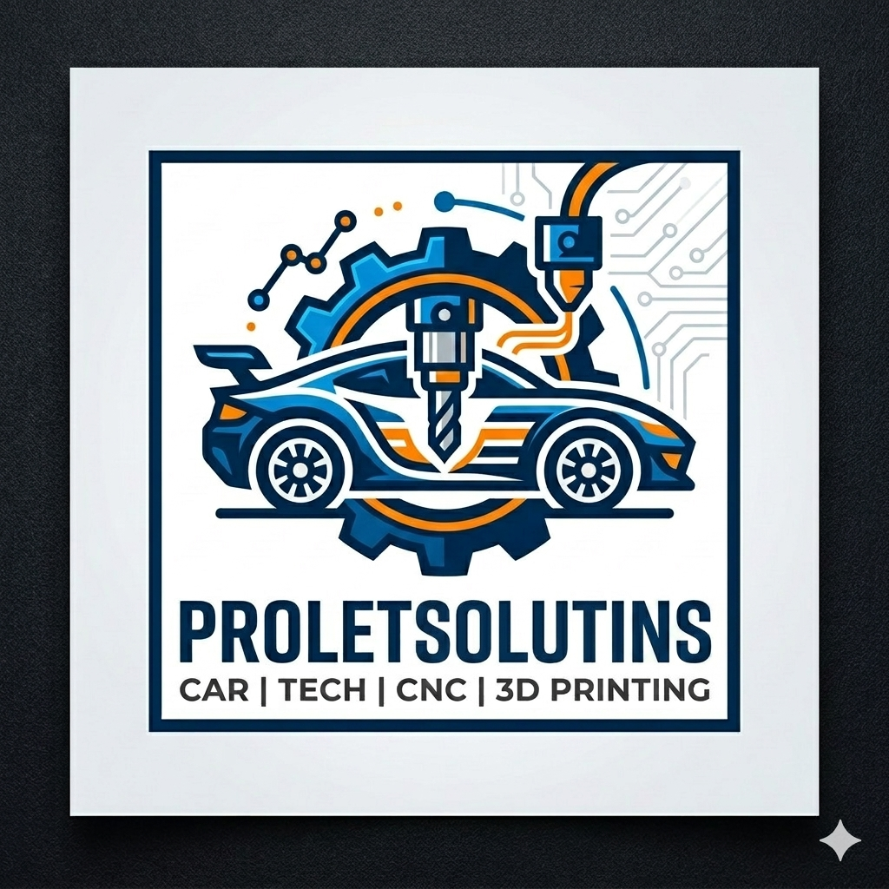

  
  <h1>Welcome to ProLet Solutions</h1>

We are a multidisciplinary collective of engineers, makers, and enthusiasts where digital precision crashes head-on into greasy reality. We don't just solve problems; we build the Solutions, usually to the rhythm of a wrench turning or a laser firing.

Our core mission is simple: to make things go faster, work smarter, and look better—whether it's on a racetrack, a server rack, or a workbench.

---

## 👥 The Team and Their Expertise
Our strength comes from a chaotic yet effective blend of skill sets:

*   **🏎️ Mechanical Resurrection (Jan):** Every team needs the guy who can keep a doomed E36 running for one more track day. Jan provides the raw, hands-on mechanical empathy required to take complex systems—and "shitty cars"—apart and put them back together (hopefully with fewer leftover screws).
*   **🧠 Systems Architect (Petr):** When the problem is complex, you need an intellect that can bridge gap between hardware and software. Petr is our knowledge engine, handling everything from ECU tuning to server management. He provides the smarts that drive the machines.
*   **⚡ Operational Powerhouse (Sada):** The human element. Sada is the muscle, the endurance, and the reliable energy that pushes projects across the finish line. Every sprint, physical or digital, needs his stamina.
*   **🤖 The Digital Fabricator (Lukas):** This is where concepts become tangible. Specializing in 3D printing, CNC machining, and embedded systems, Lukas is the bridge between a circuit diagram and a custom-milled aluminum bracket. He handles the precision manufacturing and the code that makes the hardware come alive.

---

## 🚀 What We Do
We use the tools of modern manufacturing and the knowledge of old-school mechanics to tackle projects that bridge the physical and digital. Our GitHub organization is a repository for:

*   **Automotive Tech:** Custom parts for (inevitably, probably BMW) cars, ECU tuning software, and OBD interface tools.
*   **Precision Making:** CAD files for 3D printed modifications, G-code for CNC-milled components, and firmware for custom-built fabrication machines.
*   **Infrastructure:** Server configuration scripts, network optimization tools, and embedded system code for automation projects.

---

> **In short:** we turn ideas into prototypes, prototypes into running machines, and (sometimes) running machines into shitty running machines that we fix again.

**ProLetSolutions.** We have the technology, the tools, and the (mostly) functional cars to make it happen.
